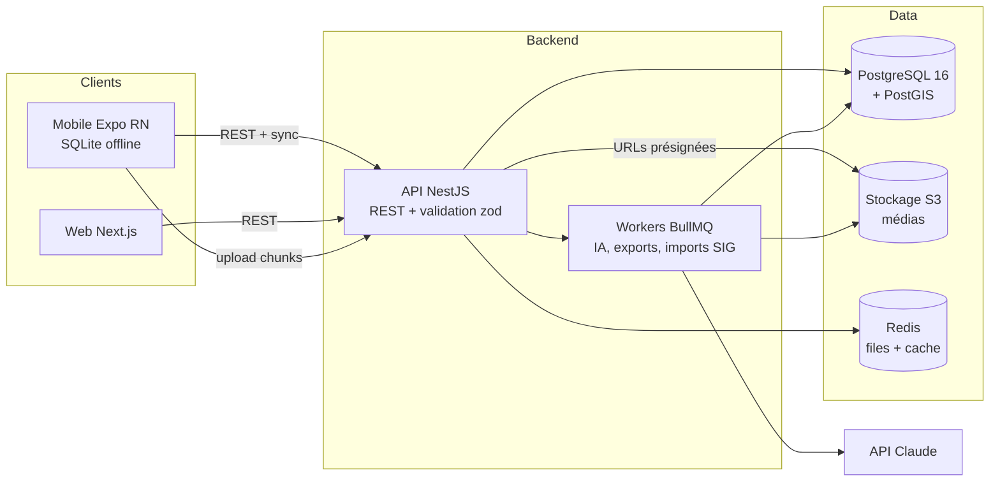

# 09 — Architecture

## 1. Vue d'ensemble



## 2. Monorepo

```
apps/
├── api/          # NestJS : modules auth, orgs, projects, forms, submissions,
│                 #   attachments, sync, ai, gis, exports
├── web/          # Next.js App Router
└── mobile/       # Expo React Native
packages/
├── shared/       # schémas zod + types + constantes + utilitaires purs + geo (Turf)
└── form-engine/  # modèle FormSchema, évaluation logique/validation/calculs, rendu abstrait
infra/
├── docker-compose.yml   # Postgres+PostGIS, MinIO, Redis
├── migrations/          # via Prisma (apps/api)
└── ci/                  # workflows GitHub Actions
```

Outillage : pnpm workspaces + Turborepo, ESLint/Prettier partagés, Changesets pour le versionnement des packages internes.

## 3. Choix techniques (ADR résumés)

| # | Décision | Justification | Alternatives rejetées |
|---|---|---|---|
| ADR-1 | TypeScript de bout en bout, monorepo | Un seul langage, types partagés client/serveur, form-engine réutilisé 3× | Backend Python/Django (duplication de la logique de formulaire) |
| ADR-2 | React Native (Expo) | Équipe unique web+mobile, OTA updates, accès natif suffisant (caméra, GPS, SQLite, NFC) | Flutter (silo de compétences), natif ×2 (coût) |
| ADR-3 | NestJS + Prisma, **couche de données abstraite (repository pattern)** | Structure modulaire imposée (lisible par agents), DI ; toute la logique métier passe par des repositories → la base est **remplaçable** sans toucher aux services (voir ADR-4) | Supabase-only côté client (logique de sync et métier serveur difficiles à porter), Express nu (pas de structure) |
| ADR-4 | **Supabase par défaut, base modulaire** (PostgreSQL + PostGIS) | Démarrage rapide : Supabase fournit Postgres+PostGIS managé, Auth, Storage, Realtime. L'accès se fait via la couche repository (ADR-3) → portabilité vers tout **Postgres/PostGIS** : self-hosted, Neon, RDS/Aurora Postgres (voir [20_DEPLOIEMENT](20_DEPLOIEMENT.md)) | S'enfermer dans une base non remplaçable ; MongoDB (géospatial/transactions plus faibles) |
| ADR-5 | Données de soumission en JSONB | Le schéma varie par version de formulaire ; validation par form-engine côté serveur ; index GIN + colonnes dénormalisées (geom, dates) | Tables dynamiques par formulaire (complexité migrations) |
| ADR-6 | Sync custom par file d'opérations idempotentes | Le domaine est append-mostly (soumissions immuables après finalisation) : pas besoin de CRDT ; contrôle total de la reprise médias ; **indépendant de l'hébergement de la base** (Supabase managé ou Postgres auto-hébergé) | PowerSync/ElectricSQL (réplication généraliste, contrôle moindre des conflits), Supabase Realtime seul (couplage fort) |
| ADR-7 | MapLibre (web + mobile) | Open source, styles vectoriels, offline PMTiles, zéro licence | Google Maps / Mapbox GL v2+ (licences), Leaflet (pas de vectoriel/3D) |
| ADR-8 | UUID v7 générés côté client | Clés d'idempotence offline, tri temporel naturel, pas de coordination | Auto-increment (impossible offline), UUID v4 (index moins efficaces) |
| ADR-9 | IA uniquement côté serveur, jobs asynchrones | Clés protégées, coûts contrôlés, dégradable | Appels directs client → LLM (sécurité, coûts) |
| ADR-10 | S3 présigné + upload par chunks via l'API | Reprise fine des uploads sur réseau instable, quotas contrôlés | Upload direct présigné multipart (reprise moins contrôlable sur 2G) — réévaluable en V2 |
| ADR-11 | Open-core : **AGPL-3.0** (cœur) + **MIT** (packages/shared) + premium propriétaire | AGPL protège contre la reprise SaaS sans contribution ; MIT favorise l'interopérabilité avec intégrateurs ; premium finance le développement. Détails et frontière open/premium dans [21_MONETISATION §7](21_MONETISATION.md) | AGPL perçue comme restrictive (relicenciable en MIT si frein constaté), MIT seul (pas de protection) |
| ADR-12 | Fournisseur satellite premium : **Planet** (add-on) + **Sentinel Hub** (socle radar gratuit) | Planet : revisite quotidienne, programme NICFI gratuit ONG forêts, API XYZ/WMS. Sentinel Hub : radar Sentinel-1 gratuit (traverse nuages — indispensable zones tropicales). Voir [08_GIS §2b](08_GIS.md) et [23_COUTS §5](23_COUTS.md) | Maxar (trop coûteux, pas de programme ONG), MapTiler satellite (résolution insuffisante pour usage premium) |

## 3bis. Couche de données modulaire (base remplaçable)

Principe : **aucun service métier ne connaît la base concrète.** Toute lecture/écriture passe par des interfaces de repository définies dans le domaine ; les implémentations sont interchangeables via un adaptateur choisi par configuration (`DATA_DRIVER`).

```
Services métier
   │  (interfaces Repository — ne dépendent d'aucune techno)
   ▼
Adaptateur de données  ──►  Supabase (Postgres+PostGIS)        ← défaut cloud
                        └─►  Postgres+PostGIS self-hosted / Neon / RDS-Aurora
```

- **Supabase (défaut).** Fournit Postgres 16 + PostGIS, Storage (médias), Auth (option) et Realtime. On l'utilise comme **backing services managés** ; la logique métier, la sync et l'IA restent dans notre API NestJS. Migrations gérées par Prisma sur la base Supabase.
- **Portabilité.** L'accès passe par des interfaces de repository ; on reste dans la **famille PostgreSQL/PostGIS** (Supabase managé en SaaS, Postgres auto-hébergé pour la souveraineté) — ce qui préserve **100 % du SIG serveur** (placettes, `ST_*`, tuiles MVT) quel que soit l'hébergement. Un jeu de tests de conformité valide chaque adaptateur contre le même contrat. Détail des cibles : [20_DEPLOIEMENT §3](20_DEPLOIEMENT.md).

## 4. Backend (`apps/api`)

- Modules NestJS alignés sur les ressources de [11_API.md](11_API.md). Chaque module : controller (validation zod via pipe), service (logique), **repository (interface) → adaptateur (Supabase / Postgres self-hosted)**.
- **Multi-tenant par `organization_id`** sur toutes les tables métier ; garde global qui scope chaque requête à l'organisation du token ; tests dédiés d'isolation inter-tenants.
- AuthN : JWT access (15 min) + refresh (rotation, 30 j, révocable) ; argon2id pour les mots de passe. AuthZ : RBAC (rôle par membership) via guards + matrice de permissions de [10_DATABASE.md §6](10_DATABASE.md).
- Validation : tout payload entrant passe par les schémas zod de `packages/shared` ; les soumissions sont revalidées côté serveur par `form-engine` contre la version exacte du formulaire.
- Jobs (BullMQ/Redis) : IA, exports, imports SIG, préparation de cartes offline, contrôle qualité. L'API reste sans état (scalable horizontalement).
- Observabilité : logs structurés (pino, request-id), Sentry, métriques Prometheus (latence, files, taux d'erreur de sync).

## 5. Stockage des médias

Upload : le client déclare l'attachment (métadonnées) → l'API crée l'enregistrement et attend les chunks (5 Mo) → assemblage → put S3 → statut `stored`. Téléchargement : URLs présignées à durée courte (15 min) délivrées par l'API selon les permissions. Buckets privés, chiffrement au repos, antivirus optionnel (ENT). Nom d'objet = `org/{orgId}/submissions/{submissionUuid}/{attachmentUuid}` (jamais le nom de fichier client).

## 6. Protocole de synchronisation

Conception : le domaine évite les conflits — les soumissions sont **immuables après finalisation** (sauf boucle de rejet, mono-auteur, une révision à la fois) ; les formulaires ne descendent que comme versions immuables.

### Montée (mobile → serveur)
1. `POST /sync/submissions` — lot de soumissions finalisées `{uuid, form_id, form_version, data, meta}`. Serveur : pour chaque uuid — inconnu → validation form-engine → insert ; déjà accepté → réponse `already_synced` (idempotence) ; invalide → `rejected_invalid` avec détails (l'app la repasse en brouillon annoté). Réponse par élément.
2. Pour chaque attachment : `POST /attachments` (déclaration) → `PUT /attachments/:uuid/chunks/:n` (reprise via `GET /attachments/:uuid/status`) → `POST /attachments/:uuid/complete`.
3. Révisions post-rejet : `PUT /sync/submissions/:uuid/revision` avec `base_revision` ; si la base ne correspond pas (révision concurrente — cas anormal), le serveur conserve les deux et marque `conflict` pour arbitrage web ; **jamais d'écrasement silencieux**.

### Descente (serveur → mobile)
`GET /sync/updates?since=<cursor>` → delta : versions de formulaires publiées, assignations, statuts (approuvée/rejetée + motif), référentiels, invalidations. Curseur opaque (timestamp logique par organisation) renvoyé à chaque appel ; `since=0` = resync complet.

### Garanties
- **Atomicité locale** : une soumission n'est marquée `synced` qu'après accusé serveur des données ; les médias peuvent suivre (statut `synced_pending_media` visible).
- **Ordre** : FIFO par soumission ; parallélisme uniquement sur les chunks d'un même fichier.
- **Reprise** : tout est rejouable ; le crash à n'importe quelle étape ne produit ni perte ni doublon (tests d'injection de pannes obligatoires).

## 7. Sécurité

- TLS 1.2+ partout ; HSTS ; cookies web httpOnly/secure/SameSite + CSRF ; mobile : Bearer JWT.
- Chiffrement au repos : Postgres (volume), S3 (SSE), mobile (SecureStore pour secrets ; SQLCipher en ENT).
- Rate limiting (par IP et par compte) sur auth et sync ; verrouillage progressif des comptes.
- Audit log immuable des actions sensibles ([10_DATABASE.md §7](10_DATABASE.md)).
- Secrets via env uniquement ; rotation documentée ; dépendances scannées en CI (audit + Dependabot).
- RGPD : minimisation, export/suppression par organisation, sous-traitants documentés (hébergeur UE, Anthropic pour l'IA opt-out).

## 8. Environnements & déploiement

| Env | Usage | Infra |
|---|---|---|
| local | dev | docker-compose (Postgres+PostGIS, MinIO, Redis) ou projet Supabase de dev |
| staging | validation continue | Supabase + conteneurs API (Fly.io/Render/VPS) |
| production SaaS | clients cloud | Supabase managé, sauvegardes PITR, monitoring |
| production self-hosted | client sur son serveur | pile Docker Compose complète livrée (voir [20_DEPLOIEMENT](20_DEPLOIEMENT.md)) |

**Modèles de déploiement** (détaillés dans [20_DEPLOIEMENT.md](20_DEPLOIEMENT.md)) : (1) **SaaS** sur notre plateforme (défaut) ; (2) **auto-hébergé** chez le client (souveraineté totale des données) ; (3) clients **PWA** et **application bureau** (Tauri/Electron) pour les postes superviseurs ; (4) **mobile qui s'adapte à toute configuration** en pointant vers l'URL du backend choisi (notre cloud ou le serveur du client).

CI/CD : GitHub Actions — lint/typecheck/tests sur PR ; build & deploy staging sur merge `main` ; production sur tag. Mobile : EAS Build + OTA (updates JS), stores pour les changements natifs. Migrations : `prisma migrate deploy` en étape de déploiement, toujours rétrocompatibles N-1 (expand/contract).

## 9. Décisions ouvertes (à trancher avant la phase concernée)

| Sujet | Échéance | Options |
|---|---|---|
| ~~Fournisseur satellite premium de référence~~ | ✅ **Tranché** | **Planet** (add-on) + **Sentinel Hub** (socle radar gratuit). Voir [08_GIS §2b](08_GIS.md) et ADR-12 |
| ~~Licence open-core~~ | ✅ **Tranché** | **AGPL-3.0** (cœur) + **MIT** (shared) + premium propriétaire. Voir [21_MONETISATION §7](21_MONETISATION.md) et ADR-11 |
| Websockets pour le temps réel web | V2 | SSE vs socket.io vs polling conservé |
| Passage à l'upload S3 multipart direct | V2 | selon métriques de reprise réelle terrain |
| Base mobile : ajout de SQLCipher généralisé | ENT | impact perf à mesurer |
